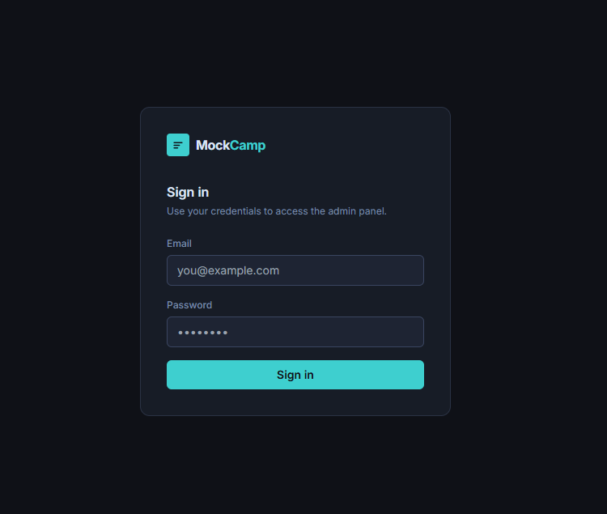
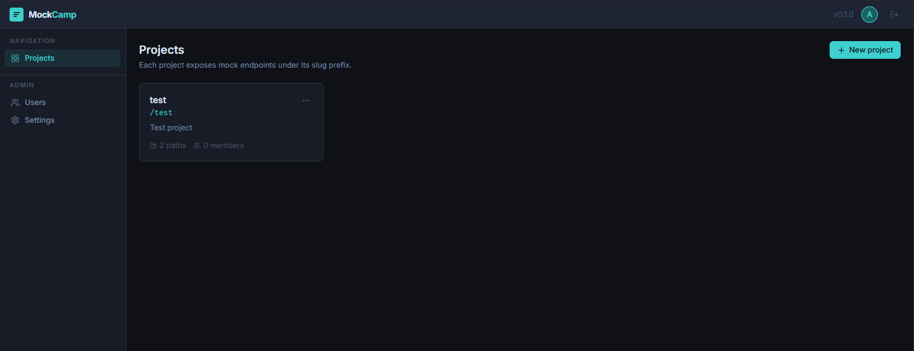
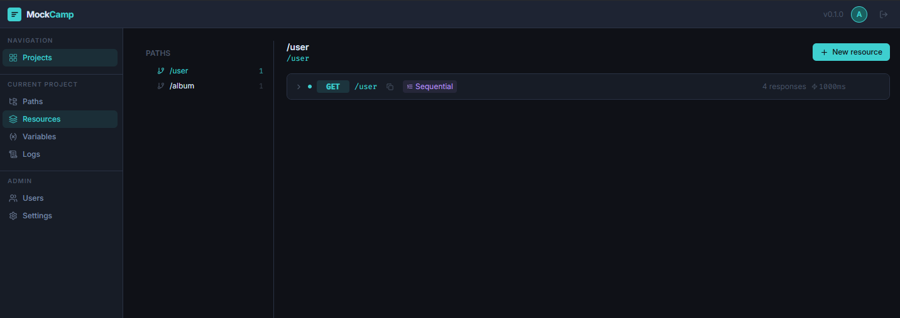
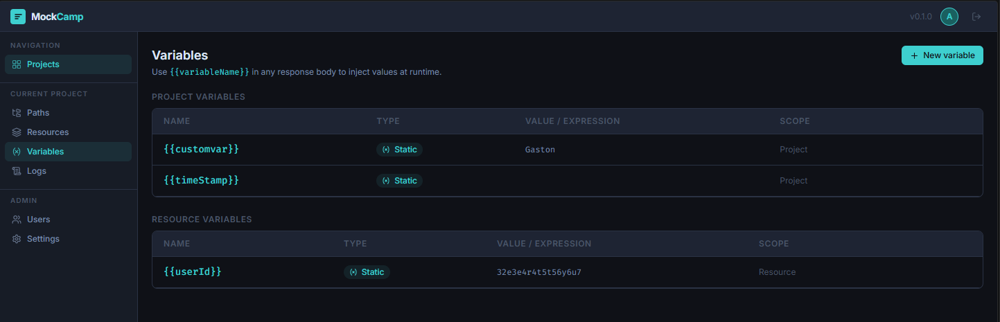
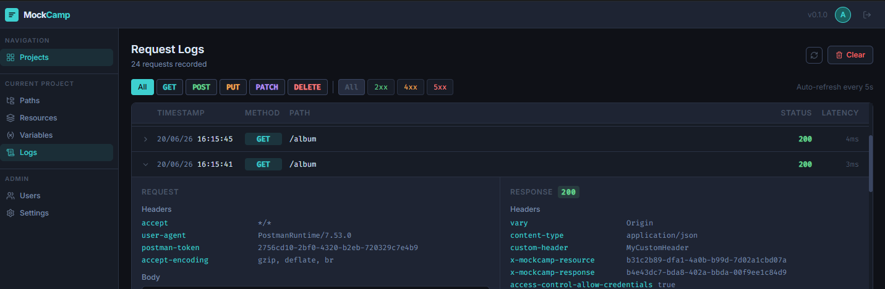
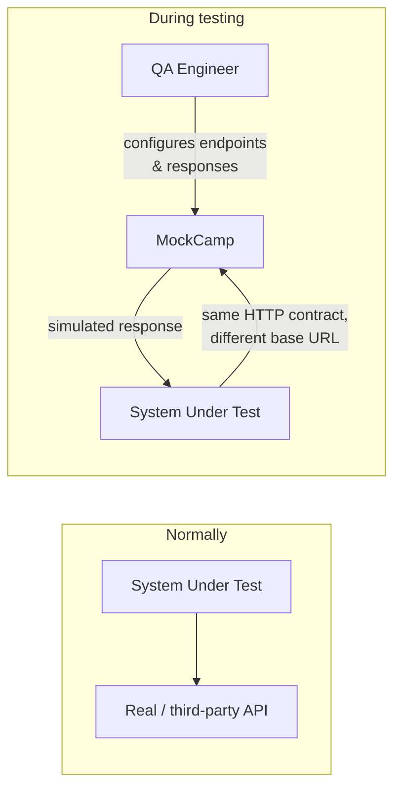

# MockCamp

MockCamp is a mock server for QA teams. Instead of writing code to stand up a fake API,
you configure HTTP endpoints through an admin panel — paths, methods, status codes,
headers, response bodies, delays, error rates — and MockCamp serves them as real,
reachable HTTP endpoints that your tests, frontend, or Postman collection can call
directly.

It's aimed at teams that need to simulate a third-party API or an unfinished backend
service during testing, without maintaining a hand-rolled mock in every test suite.
It runs as a single process with a local SQLite database — no separate database server
to install or manage.

## Screenshots

**Login**



**Projects**



**Paths & Resources**



**Variables**



**Request Logs**



## Features

- **Projects & Paths** — organize mocks per project, each with its own URL slug, and
  build a nested path tree (e.g. `/payments` → `/payments/{id}`).
- **Resources & Responses** — define an HTTP method on a path, then attach one or more
  possible responses with their own status code, headers, and body (JSON, XML, or plain
  text).
- **Four response-selection strategies** per resource:
  - **Fixed** — always returns the response marked as default.
  - **Random** — picks a response at random, weighted per response.
  - **Sequential** — cycles through responses in order on every call.
  - **Conditional** — evaluates expressions against the incoming request
    (`request.body.amount > 1000`, `request.headers["x-api-key"] == "secret"`,
    `request.query.page exists`, …) and returns the first matching response.
- **Variables** — inject dynamic values into a response body with `{{variableName}}`.
  Variables can be `STATIC` (a fixed value) or `DYNAMIC` (extracted from the incoming
  request), scoped to a whole project or to a single resource.
- **Delay & error-rate simulation** — add a fixed or random latency, and make a resource
  fail with a configurable probability, to test how your client handles slow or flaky
  dependencies.
- **Request log viewer** — every call to a mock endpoint is recorded (method, path,
  status, latency, headers, body) and viewable per project, with filtering.
- **Role-based access** — a global **Admin** manages users and all projects; a
  **Project Admin** manages one project's configuration and membership; a **Tester**
  can read and exercise a project's mocks.

## Tech stack

| | |
|---|---|
| **Server** | [Fastify](https://fastify.io) + [Prisma](https://www.prisma.io) ORM on [SQLite](https://www.sqlite.org), JWT auth (`@fastify/jwt`), [Zod](https://zod.dev) validation, bcrypt password hashing |
| **Client** | [React](https://react.dev) + [Vite](https://vitejs.dev), [TanStack Query](https://tanstack.com/query) for data fetching, [Tailwind CSS](https://tailwindcss.com), React Router |
| **Testing** | [Vitest](https://vitest.dev) |
| **Language** | TypeScript end to end (strict mode, ESM/`NodeNext`) |

## Requirements

- Node.js 20+

No separate database to install — MockCamp uses SQLite, stored as a single file next to
the server.

## Installation

```bash
# 1. Install dependencies for both packages
#    (plain `npm install` at the root only installs the dev tooling — use this instead)
npm run install:all

# 2. Configure the server's environment
cp packages/server/.env.example packages/server/.env
# The default DATABASE_URL (a local SQLite file) and JWT_SECRET already work for local use —
# only change JWT_SECRET before deploying anywhere other than your own machine.

# 3. Run database migrations
npm run db:migrate

# 4. Seed the initial admin user
npm run db:seed

# 5. Start the dev server (server on :3000, client on :5173)
npm run dev
```

Open **http://localhost:5173** during development (it proxies API calls to the server).
In production, `npm run build` bundles the client into the server, which then serves
everything from a single port — open **http://localhost:3000/_admin**.

## Getting started

1. Run the steps in [Installation](#installation) above.
2. Open the admin panel and log in with the seeded credentials:

   ```
   Email:    admin@mockcamp.local
   Password: happyMocking123
   ```

3. You'll immediately be asked to set a new password — this is enforced on first login
   and can't be skipped.
4. Create your first **Project** (it needs a name and a URL-safe slug, e.g. `payments-api`).
5. Build out a **Path** (e.g. `/payments/{id}`), add a **Resource** on it (e.g. `GET`),
   and give that resource a **Response** (status `200`, a JSON body).
6. Your mock is now live — call it directly:

   ```bash
   curl http://localhost:3000/payments-api/payments/1
   ```

7. Optional next steps: add more responses and switch the resource's strategy to
   `CONDITIONAL` or `RANDOM`, define a `{{variable}}` and reference it in a response
   body, or invite teammates to the project via **Project → Members** (as an Admin or
   Project Admin).

## How it works

A single Fastify server exposes two separate surfaces:

- **`/_admin/*`** — the React admin panel (served as a static build) and its REST API
  under `/_admin/api/*`. This is where you configure everything described above.
- **`/{project-slug}/*`** — the mock engine itself. Any request that doesn't start with
  `/_admin` is matched against your configured projects by slug, then against that
  project's resources by HTTP method and path, and answered according to the matched
  resource's strategy, delay, and error rate — with no authentication required, since
  these are meant to be called like a real third-party API.

Every mock request is logged to the local SQLite database and shows up in that project's
**Logs** screen in near real time (the log viewer polls every 5 seconds).

The key idea: your **System Under Test** doesn't know the difference. It calls MockCamp
over plain HTTP using the exact same contract it would use against the real dependency —
only the base URL changes.



## Project structure

```
mockcamp/
├── packages/
│   ├── server/                 # Fastify + Prisma (port 3000)
│   │   ├── src/
│   │   │   ├── app.ts          # Plugin registration, global error handler
│   │   │   ├── index.ts        # Entry point
│   │   │   ├── lib/            # Auth, ownership checks, mock-engine logic
│   │   │   └── routes/
│   │   │       ├── admin/      # /_admin/api/* — one file per resource
│   │   │       └── mock-engine.ts  # /{slug}/* — HTTP wiring for the mock engine
│   │   └── prisma/
│   │       ├── schema.prisma
│   │       └── migrations/
│   └── client/                 # React + Vite admin panel
│       └── src/
│           ├── pages/          # One screen per route
│           ├── hooks/          # React Query hooks, one per entity
│           └── components/
└── package.json                 # Root scripts (install:all, dev, build, db:*, test)
```

## Available scripts

Run these from the repo root (`mockcamp/`):

| Command | Does what |
|---|---|
| `npm run install:all` | Installs dependencies for both `packages/server` and `packages/client` |
| `npm run dev` | Starts server (`:3000`) and client (`:5173`) together, with hot reload |
| `npm run build` | Builds the client, then the server, for production |
| `npm run db:migrate` | Applies Prisma migrations |
| `npm run db:seed` | Creates the initial admin user |
| `npm run db:studio` | Opens Prisma Studio to browse the database |
| `npm run db:generate` | Regenerates the Prisma client after a schema change |
| `npm test` | Runs the server's Vitest suite |

## Default credentials

After seeding: **`admin@mockcamp.local`** / **`happyMocking123`**.
A password change is required on first login.

## License

[MIT](LICENSE)
